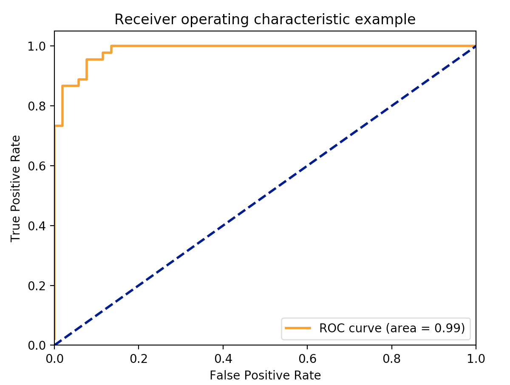

# LSS-Similarity

## Dataset Preparation

### Prepare SQL/NL Data

   Use the [Web-Crawler-for-NL2SQL](https://github.com/postech-db-lab-starlab/Web-Crawler-for-NL2SQL) to extract the web-crawled SQL and natural language data. The data will be saved to the PostgreSQL dataset

### Prepare SQL/NL Alignments

   We use [english word aligner](https://github.com/FerreroJeremy/monolingual-word-aligner) to align words in SQL and NL and extract features from the alignments.
   
   To align words in SQL and NL, first change directory to ```monolingual-word-aligner```
   ```
   cd monolingual-word-aligner
   ```

   Then, run the following codes.
   ```
   python run_all_mining.py
   python3 InputWords.py
   python run_all_align.py
   ```

   Following codes align words in SQL and NL, and save the alignment information into the database ```alignments.dls_cu```.

### Prepare Answers

   In order to train the XGBoost Model, manually marked answers are needed. The answers should be stored in PostgreSQL database as follows.
   ```
   Schema: "answers"
   Table: "sql_0_0_nl_0"
   Headers: ["sql_id", "nl_id"]
   ```
   Each row in answers.sql_0_0_nl_0 table stores answer as pair of ids ("sql_id", "nl_id").

### Word Embedding

   You can download the word embedding by following codes:
   ```
   wget http://clic.cimec.unitn.it/composes/materials/EN-wform.w.5.cbow.neg10.400.subsmpl.txt.gz
   gunzip EN-wform.w.5.cbow.neg10.400.subsmpl.txt.gz
   ```

   Move ```EN-wform.w.5.cbow.neg10.400.subsmpl.txt``` to ```data``` directory.

## Extract Features
   
   You can extract features from SQL, NL pair by running the following code.
   ```
   python feature_extract.py
   ```
   Features are stored in file ```data/features.txt``` in form ```(<sql_id> <nl_id> <feat0> <feat1> <feat2>)```

   Run the following code to re-format the file for XGBoost Model.
   ```
   python modify_feature.py
   ```

   All features and answers for each feature are stored in file ```data/feature_answer_all.txt``` in form ```(<sql_id> <nl_id> <feat0> <feat1> <feat2> <answer>)``` where ```<answer>``` is 1 or 0

## Run XGBoost/Neural Network Model

### Configuration

   To train/test the XGBoost/Neural Network Model, firstly, configuration file should be set.

   For XGBoost model, set up the ```config/xgb_params.json``` file:
   ```
   {
    "test_ratio": 0.2,                    # Ratio of Test data in whole dataset
    "model_type": "xgb",                  # Type of model, (xgb/neural)
    "pretrained_model": "",               # To use the pretrained model, insert path to the pretrained model
    "save_model": false,                  # Save the final model for later use. (at data/saved_model)
    "model":{                             # Model configs. Search xgboost.XGBoostClassifier for more information
        "objective": "binary:logistic",   
        "eval_metric" : "auc",            
        "learning_rate" : 0.1,
        "max_depth": 1,
        "min_child_weight": 1,
        "subsample": 1,
        "colsample_bytree": 1,
        "gamma" : 0,
        "reg_alpha": 0,
        "reg_lambda": 1
        }
   }
   ```

   For Neural network model, set up the ```config/neural_params.json``` file:
   ```
   {
    "test_ratio": 0.2,                    # Ratio of Test data in whole dataset
    "model_type": "neural",               # Type of model, (xgb/neural)
    "pretrained_model": "",               # To use the pretrained model, insert path to the pretrained model
    "save_model": false,                  # Save the final model for later use. (at data/saved_model)
    "model":{                             # Model configs.
        "objective": "regression",        # Type of neural network model, (regression/classification)
        "num_epoch": 500,                 # Number of epoch to train
        "lr": 1e-3,                       # Learning rate
        "hidden_dim": 10,                 # Dimension of hidden vector
        "validation": true                # Validate the model and find best model
        }
   }
   ```


### Train

   Set up all the parameters in ```config/xgb_params.json``` file or ```config/neural_params.json``` file.

   You can train the model and test the code by running the code below:
   ```
   python nl_sql_dist.py --parameters xgb_params.json
   ```

   With provided sample features, you would get results as follows:
   ```
   Accuracy: 92.78%
   True Positive: 42
   False Positive: 4
   False Negative: 3
   True Negative: 48
   -----------------------------
   Precision: 0.91
   Recall: 0.93
   =============================
   ```
   The ROC curve would be shown like this:
   

   To train the neural network model, use the following code:
   ```
   python nl_sql_dist.py --parameters neural_params.json
   ```

   With proided sample features, you would get results as follows:
   ```
   Accuracy: 94.85%
   True Positive: 43
   False Positive: 3
   False Negative: 2
   True Negative: 49
   -----------------------------
   Precision: 0.93
   Recall: 0.96
   =============================
   ```
   The ROC curve would be shown like this:
   

### Test

   Firstly, you should update the ```config/xgb_params.json``` file or ```config/neural_params.json``` to direct pretrained model file.

   You can load the existing model by running the following code:
   ```
   python nl_sql_dist.py --parameters <PARAMETER_FILE_PATH>
   ```
   We provide the pre-trained model for test, named ```data/saved_model/XGB_TEST1.dat```.

   If you use the pre-trained model, the program will use all the data in ```data/feature_answer_all.txt``` as test data.
